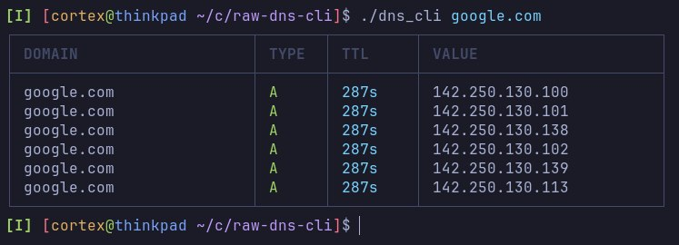
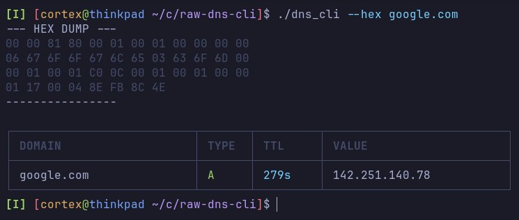
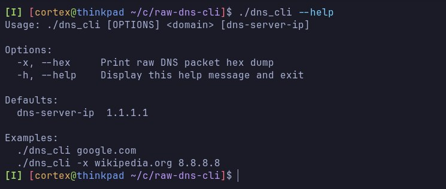

# raw-dns-cli

A minimal DNS CLI tool for educational purposes. Look up DNS records from the command line with a clean table output, hex dump mode, and customizable DNS servers.


## Features

- 🔍 **A/AAAA/CNAME record resolution** – Look up IPv4, IPv6, and alias records
- 📦 **Hex dump mode** (`-x`) – View raw DNS packets in hexadecimal format
- 🌐 **Custom DNS server** – specify any resolver (default: 1.1.1.1)
- 🎨 **Color-coded output** – Green for A records, blue for AAAA, yellow for CNAME
- 📋 **Table formatting** – Pretty-printed results with unicode box-drawing characters
- 🛠️ **Simple CLI** – `dns_cli domain [dns-server-ip]`

## Installation

### Standard

```bash
# Clone the repository
git clone https://github.com/df1gg/raw-dns-cli.git
cd raw-dns-cli

# Build with make
make

# Or compile manually
gcc -Wall -Wextra -Werror -pedantic -std=c11 -Iinclude src/*.c -o dns_cli
```

### If you use Nix:

```bash
nix-shell
make
```

## Usage

```bash
# Basic A record lookup
./dns_cli google.com

# With hex dump
./dns_cli -x google.com

# Custom DNS server with hex dump
./dns_cli -x google.com 8.8.8.8

# Show help
./dns_cli -h
```

## Screenshots



*Standard A record resolution for google.com*



*Raw DNS packet hex dump with -x flag*



*Usage information with -h flag*

## Project Structure

```
raw-dns-cli/
├── include/         # Header files (domain.h, network.h, table_print.h)
├── src/            # Source files (domain.c, main.c, network.c, table_print.c)
├── Makefile        # Build automation
├── .gitignore
├── shell.nix       # Nix development environment
└── README.md       # This file
```

Generated files (`dns_cli`, `build/`) are excluded via `.gitignore`.

## How it works

1. **Query construction** (`main.c` + `network.c`): Builds a standard DNS query with the domain name encoded in wire format, transaction ID, and query type/class
2. **UDP send** (`send_query`): Sends the query via SOCK_DGRAM to the specified DNS server on port 53
3. **Response parsing** (`parse_recv`): Parses the DNS response, extracts answer records, and handles name compression pointers
4. **Display** (`table_print`): Renders results in a color-coded table with proper formatting

## License

This project is licensed under the MIT License – see the [LICENSE](LICENSE) file for details.

## TODO / Future improvements

- [x] Basic A record resolution
- [x] AAAA/CNAME record types
- [x] Hex dump mode
- [x] Color-coded output
- [x] Socket timeout & retries (-t / --timeout)
- [ ] EDNS support
- [ ] TCP fallback for large responses
- [ ] Async/non-blocking I/O
- [ ] Additional record types (MX, TXT, SRV)
- [ ] JSON output option (--json)
- [ ] Reverse DNS lookup (PTR records)
